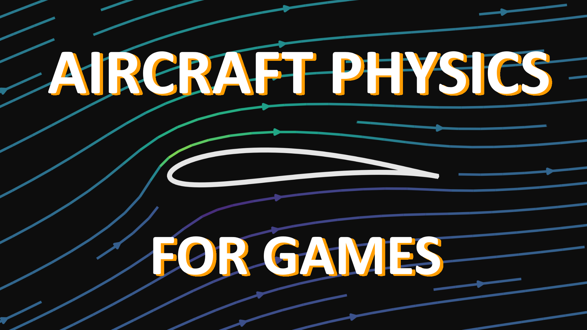
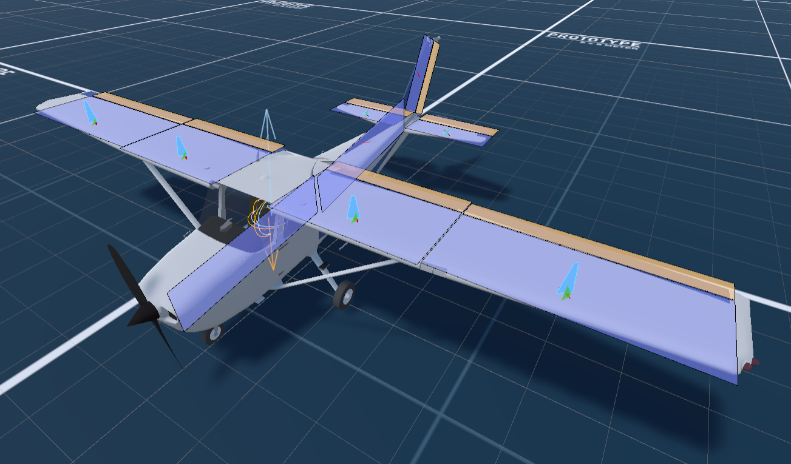

# Aircraft-Physics
Fixed wing aircraft physics for games. Based on paper by Khan and Nahon 2015.

**W. Khan and M. Nahon**, "Real-time modeling of agile fixed-wing UAV aerodynamics," 2015 *International Conference on Unmanned Aircraft Systems* (ICUAS), Denver, CO, 2015, pp. 1188-1195, doi: 10.1109/ICUAS.2015.7152411.

 [__Video__](https://youtu.be/p3jDJ9FtTyM) explaining the basics of how the system works.
 

## How to use it

### Getting started

To get started download the repo and open the project in Unity. Open the scene *Cessna-172* in the folder *Assets/Aircraft Physics/Example/Scenes*. In this scene I set up a simple plane. You can try to fly it by hitting play and using instructions on the screen. 

*Note that this is not a fully realistic Cessna-172. The equations in Khan and Nahon 2015 result in about a 1.5 times more drag than measured for real Cessna. This is probably the result of me using the model outside of its range of applicability. Because of this reason I had to multiply the thrust of the real plane by 1.5. The other significant difference is in the position of the center of mass. Unity doesn't allow to set density to individual colliders, so the COM is way off.*

### Components
Let's see what components do we have on the *Aircraft* game object. First of all, there is a `Rigidbody`. Note that it has it's Drag and Angular Drag fields set to zero. Unity's built-in drag will mess up the physics of the plane. Though you *can* have a little bit of angular drag for extra stability, you don't *need* it.

The second component is `AircraftPhysics`. It applies aerodynamic forces and thrust to the `Rigidbody`. It exposes a field for the thrust force in newtons and a list of `AeroSurface`s. This model computes the total force and torque acting on an airplane as a sum of impacts of separate parts, represented by the game objects with `AeroSurface` components. `AeroSurface` can be a wing, or a part of a wing, or a part of a tail etc. The rectangular gizmos represent all the `AeroSurface`s that constitute this aircraft. The child object of *Aircraft* called *Aerodynamics* contains as its children a number of `AeroSurface`s referenced in the list in `AircraftPhysics`. 
 

The last component is `AircraftController`. It interacts with the `AircraftPhysics` and `AeroSurface`s to apply control inputs to the plane. `AircraftPhysics` and `AeroSurface` are core the parts of the system and don't need to be changed most of the time. The `AircraftController` however is written as an example which you can expand upon.

The another important child of *Aircraft* called *Collision* has all the colliders which constitute the plane. For gears I use Unity's `WheelCollider`. It can be tricky to work with and quite unpredictable (though the same can probably be said about this system). You can change `WheelCollider` for something simpler and more robust. 

### AeroSurface
1. Add `Rigidbody` to your plane. Set linear and angular drag to zero. Set the mass to something around the mass of the real aircraft of similar size. 
Or you can make it much lighter so it will be easier to control. 
2. Add collision. For gears I use simple spheres with slippery material. You can try to set up the wheel colliders instead, but it can be tricky. 
3. Add `AircraftPhysics` component. Orange gizmo shows the position of the center of mass. Set thrust value to about the weight of the rigidbody to make the plane easier to control. Or search for realistic thrust to weight ratio. 
4. How to add aerodynamic surfaces. Create a gameobject and add `AeroSurface` component. Add `AeroSurface` to the list in `AircraftPhysics`. `AeroSurface` requires a config file with parameters. Create `AeroSurfaceConfig` scriptable object and assign it to `AeroSurface`. 
### Balancing the aircraft
5. Create wings and horizontal tail stabiliser surfaces. You don’t need to touch parameters other than chord, aspect ratio and flapFraction. Make sure surfaces are placed perfectly symmetrically. 
6. The blue gizmo shows the point of application of the sum of aerodynamic forces or aerodynamic center. For the plane to be stable around the pitch axis aerodynamic center should be slightly behind the center of mass. If the center of mass is behind the aerodynamic center you can tweak stabilizer position or size. Or you can tweak the colliders to change your plane’s center of mass. To make small tweaks you can also change zeroLiftAoA of the stabiliser a little.
### Control surfaces
7. Create a vertical stabilizer. Then make sure to add at least two surfaces for the body, one behind and one in front of the center of mass.
8. Add control surfaces. Setup ailerons, elevator and rudder as shown on screenshot. Ailerons control roll, elevator controls pitch and rudder controls yaw. You can check how your aircraft is going to react to different angles of attack and control inputs using the display settings file.
9. Add `AircraftController` to apply control inputs.

